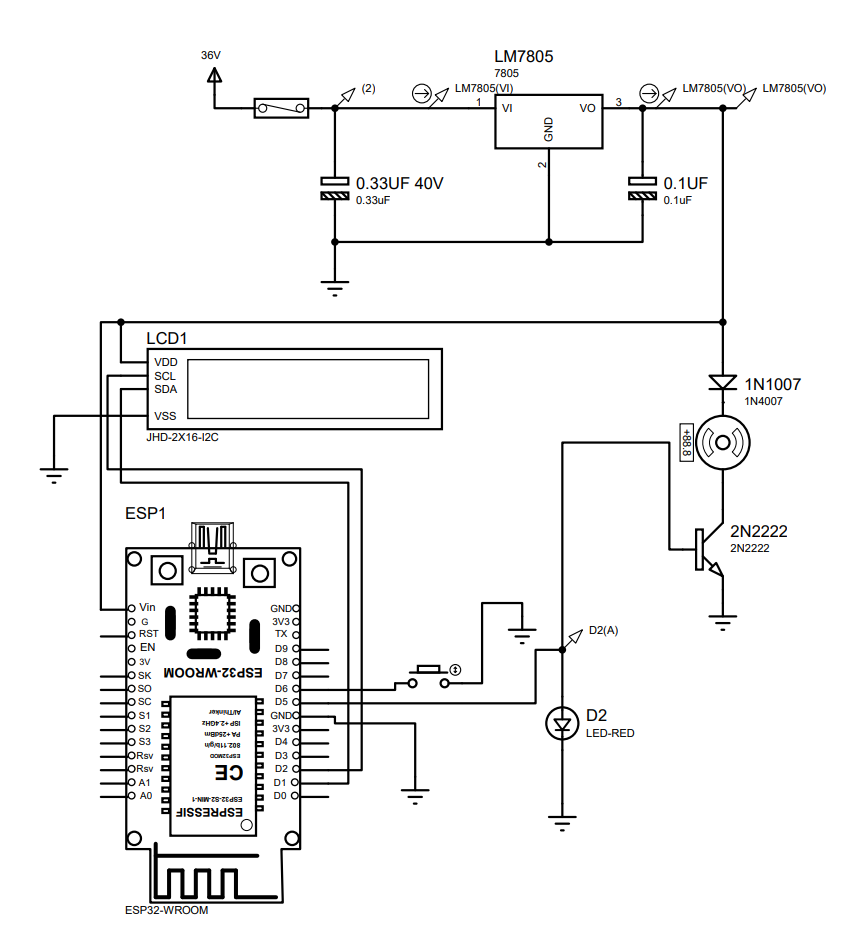
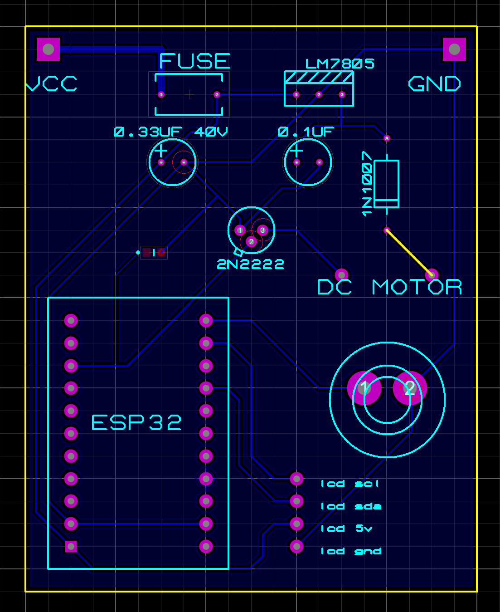
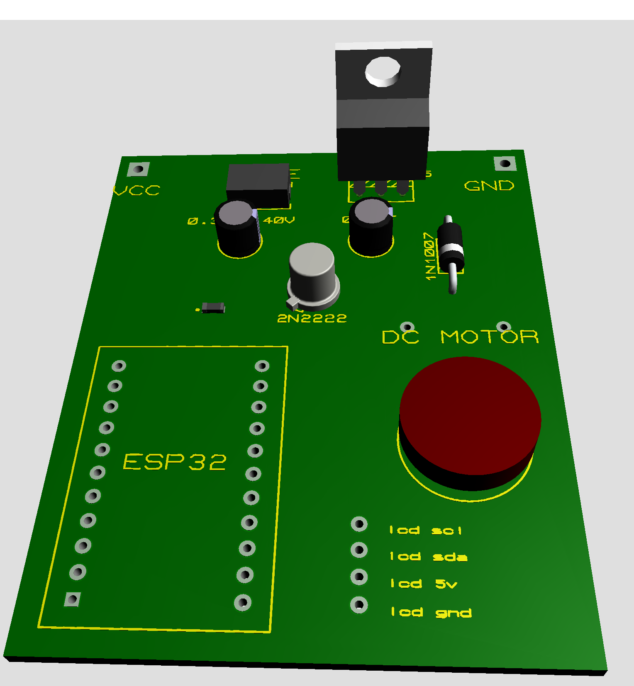

# DC-DC Converter Project for ESP32, DC Motor, and LCD Display

This project involves the development of a DC-DC converter that steps down 36V to 5V to power an **ESP32** microcontroller, a **DC motor**, and an **LCD 16x2 I2C display**.

## Overview

The system includes a DC-DC converter circuit and control logic to operate a DC motor and display relevant information on an I2C LCD. A push button triggers the system, turning on a red LED and sending a signal to a **2N2222 transistor** to activate the motor. The **1N1007 diode** is placed before the motor to prevent reverse current flow.

When the button is pressed, the message "**DC motor running**" is displayed on the LCD. Communication with the display is handled via the I2C protocol using the **LiquidCrystal_I2C** library.

### Components

#### DC-DC Converter:
- **Fuse**
- **LM7805** voltage regulator
- **0.33µF capacitor** (input stabilization)
- **0.1µF capacitor** (output noise filtering)

#### ESP32 Setup:
- **LCD JHD-2x16-I2C**
- **ESP32 WROOM**
- **Red LED (SMD)**
- **Push button**
- **DC motor**
- **2N2222 transistor**
- **1N1007 diode**

### Assembly

- **Eletronic Schematic**:

- **PCB Layout**:

- **3D Visualization**:

### Functionality

- **Button Press**: Activates the motor for 10 seconds, turning on the red LED and signaling the **2N2222 transistor** to power the motor.
- **Current Protection**: The **1N1007 diode** prevents reverse current that could damage the circuit.
- **Display**: The message "DC motor running" is shown on the LCD when the motor is active.
- **Noise Filtering**: The capacitors are used for effective noise filtering and stabilization of the power supply, ensuring the smooth operation of the **LM7805**, which acts as the voltage converter.

This project highlights the integration of basic electronic components for power regulation and control, combining software and hardware for a simple yet functional motor control system.
